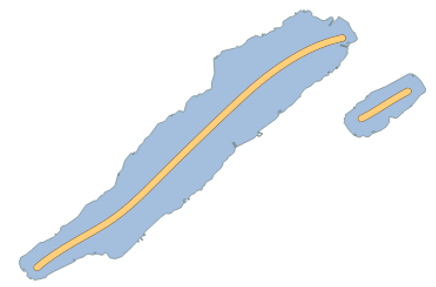

# OpenStreetMap Lake Labels



Calculate nice centered linestrings for labelling lake polygons.
This repository provides downloadable Shapefiles containing center lines for lake polygons
that you can use to label OSM lake polygons. You can match the OSM ID of the linestrings to your
data source to merge the data.

It is using [ungarj/label_centerlines](https://github.com/ungarj/label_centerlines) from Joachim Ungar to calculate the center lines. This doesn't always result the optimal result and has issues with more complicated lake structures but is sufficient enough for most use cases. Linestrings are not calculated for all lake polygons. Very small polygons, multi polygons and lakes without names are excluded.

[**:open_file_folder: Download lake center lines as GeoJSON, Shapefile, GeoPackage from the releases page**](https://github.com/lukasmartinelli/osm-lakelines/releases/latest).

## Run Workflow

The entire project is structured components using Docker containers
to work together. Ensure you meet the prerequisites.

- Install [Docker](https://docs.docker.com/engine/installation/)
- Install [Docker Compose](https://docs.docker.com/compose/install/)

Start up the PostgreSQL database with the PostGIS extension.

```bash
docker-compose up -d postgres
```

Now download a OSM PBF extract and store it in the `./data` dir.

```bash
wget -P ./data https://s3.amazonaws.com/metro-extracts.mapzen.com/zurich_switzerland.osm.pbf
```

Import the OSM PBF.

```bash
docker-compose run import-osm
```

Export a Shapefile containing simplified lake polygons.

```bash
docker-compose run export-shapefile
```

Calculate lake center lines from the previously exported Shapefile.

```bash
docker-compose run calculate-centerlines
```
